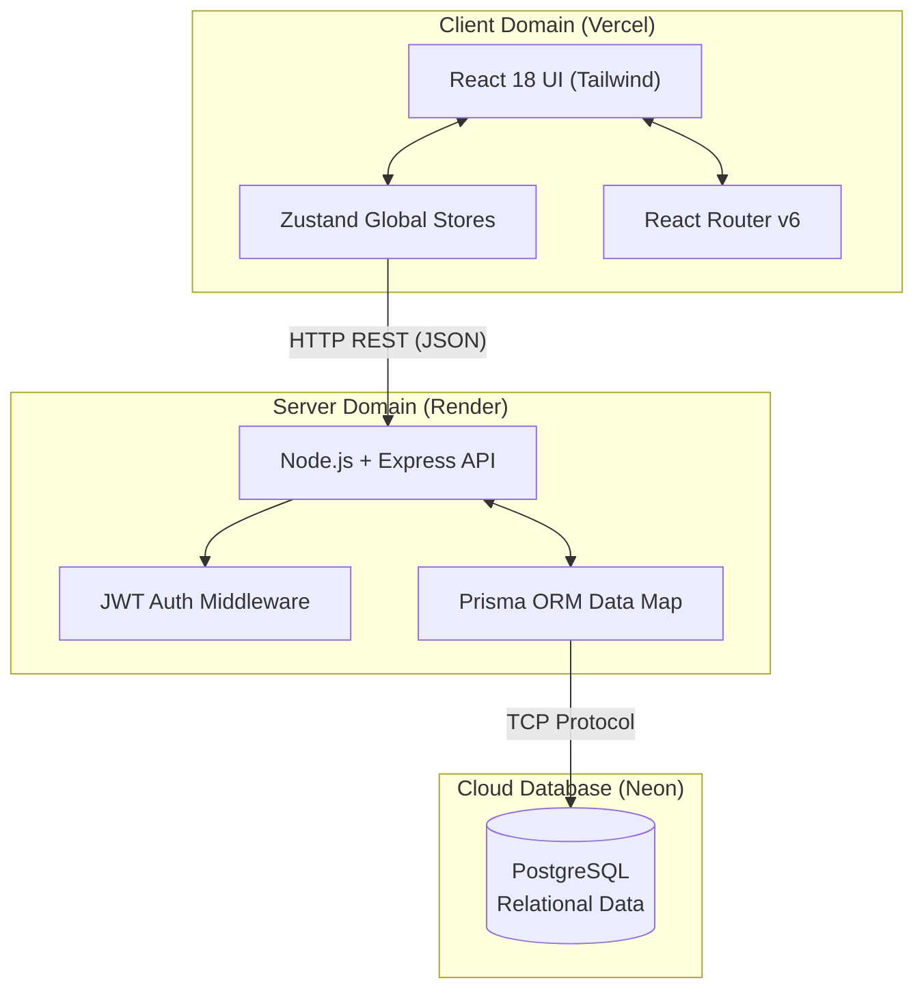

# StockFlow MVP 🚀

> **Wexa AI Technical Assessment Submission**  
> A high-performance, dark-themed SaaS Inventory Management System designed for velocity, data integrity, and multi-tenant security.

 

## 🌐 Live Deployments

- **Frontend Application:** [https://stockflow-mvp-seven.vercel.app](https://stockflow-mvp-seven.vercel.app)
- **Backend REST API:** [https://stockflow-mvp-e8zb.onrender.com](https://stockflow-mvp-e8zb.onrender.com)
  
> **Testing Instructions:** Sign up for a new account. The backend will automatically provision **mock inventory data** to immediately populate your dashboard for evaluation.

---

## 🎯 Assessment Fulfillment (PRD Checklist)

This application strictly adheres to the scope-reduced 6-Hour MVP requirements:

### ✅ 1. Authentication & Multi-Tenancy (FR-1 & FR-2)
- Built JWT-based secure user authentication (Sign Up / Log In).
- Organization constraints enforced via database relations and custom Express middleware.
- Cryptographic isolation ensures organizations cannot query outside their Tenant ID ID.

### ✅ 2. Product Architecture (FR-3 & FR-4)
- Adheres entirely to the requested schema: `ID`, `Name`, `SKU` (unique per org), `Description`, `Quantity`, `Cost Price`, `Selling Price`, `Low Stock Threshold`.
- Rendered on the client via a high-performance React data grid.

### ✅ 3. Stock Updates (FR-5)
- "Quick Adjust" buttons inline to modify stock counts rapidly.
- Fully synchronized with the backend REST endpoints.

### ✅ 4. Dashboard Analytics (FR-6)
- Automatically computes macro-level data tracking (Total Products, Total Units).
- Conditional rendering isolates "Low Stock" items based on mathematical threshold calculations (Per-product config OR Organization fallbacks).

### ✅ 5. Global Settings (FR-7)
- Organization-wide default Low Stock Threshold management.

---

## 🏗️ Technical Architecture



### 💻 Frontend (Client-Side)
- **Framework:** React 18 + Vite (Extremely fast HMR and compilation).
- **Styling:** Tailwind CSS (Institutional "Emerald & Slate" Enterprise Dark Theme).
- **State Management:** Zustand (Immutable global stores abstracting API fetch logic).
- **Routing:** React Router v6 (Custom Protected vs. Public Route guarding).
- **Hosting:** Vercel.

### ⚙️ Backend (Server-Side)
- **Framework:** Node.js + Express.js.
- **ORM:** Prisma (Strongly-typed data mapping).
- **Database:** PostgreSQL hosted natively on Neon Cloud.
- **Security:** `bcryptjs` for strict password hashing, `jsonwebtoken` for stateless auth.
- **Hosting:** Render.com.

---

## 💾 Local Development Guide

Want to run this specific evaluation build locally? Follow these steps:

### 1. Clone the Repository
```bash
git clone https://github.com/krishnabandewar/stockflow-mvp.git
cd stockflow-mvp
```

### 2. Setup Database (Backend)
```bash
cd backend
npm install
```
Create a `.env` file in the `/backend` directory:
```env
DATABASE_URL="postgresql://[YOUR_NEON_DB_URL]?sslmode=require"
JWT_SECRET="wexa-evaluation-secret-key"
PORT=5000
```
Push the schema to your local database and start the server:
```bash
npx prisma db push
npx prisma generate
npm run dev
```

### 3. Setup Frontend
Ensure the backend is running on port 5000. Open a new terminal:
```bash
# From the root /stockflow-mvp directory
npm install
```
Change the API URL in `src/store/authStore.js` and `inventoryStore.js` back to your local server:
```javascript
const API_URL = 'http://localhost:5000/api'
```
Start Vite:
```bash
npm run dev
```

---

## 🤝 Contact
- **Developer:** Krishna Bandewar
- **Focus:** Full Stack Web Application Architect
- Submitted for the Wexa AI April 2026 Assessment.
